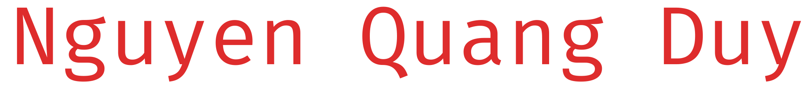

    🔺
  
    🔺

    

    
    
    
    

     
     
    
    
     

---

 

<h2>🏄🏻‍♂️ About me:</h2>

I'm Nguyen Quang Duy and currently I'm studying Computer Science at <a href="https://hcmiu.edu.vn/" target="_blank">International University</a> - <a href="https://en.wikipedia.org/wiki/Vietnam_National_University,_Ho_Chi_Minh_City" target="_blank">Vietnam National University in Ho Chi Minh City.</a> 
I'd like to work as Software Developer and Graphic Designer
I enjoy delving deeply into game design, level design, and game production as they apply to various types of problems. When working in the gaming industry,
I believe it is critical to have a broad range of knowledge in order to be prepared for anything.

- 🌱 I’m currently **`twenty-one year`** old 🤣
- 👯 I’m looking to collaborate with others
- 🥅 2023 Goals: Learn more about **`Unity`** and **`Unreal engine`**
- ⚡ Music can help me get more **`motivated`** not bugs 
- 😻 Fun fact: Do I love cat? - Yesn't 🤷🏻‍
- 🖤 And yassh! I got **`girlfriend`** 🙆

 
  
<h2>🛠️ My Favorite Tools</h2>

  <!-- Some badges are from https://github.com/Ileriayo/markdown-badges -->

  <h3>👨‍💻 Programming and Markup Languages</h3>
  
  

      
      
      
      
      
      
      
      
      
  

  <h3>💻 Software and Tools</h3>

  

      
      
      
      
      
      
      
      
      
      
      
      
      
  

#

<h2>📊 My Stats:</h2>

     <h3>🔥 Streak Stats</h3>

    

    <h3>💻 GitHub Profile Stat</h3>

  
 

<b>Note:</b> Top languages is only a metric of the languages my public code consists of and doesn't reflect experience or skill level.
  

    
    

